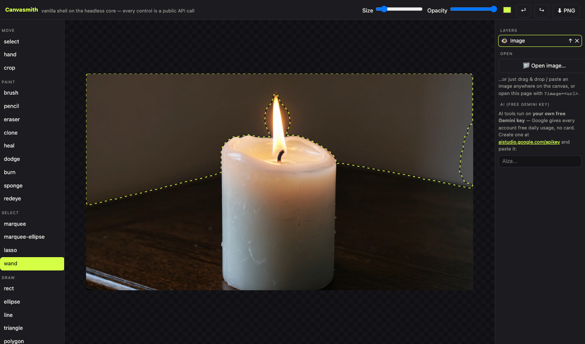
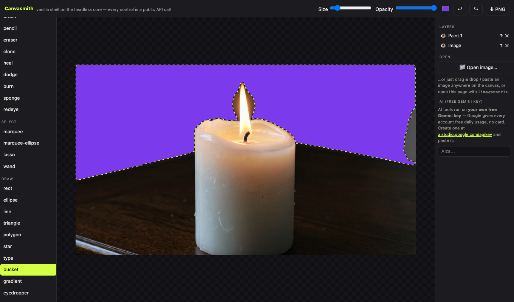
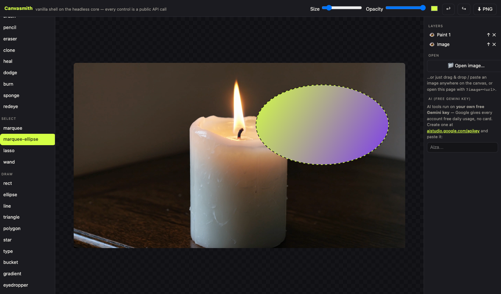
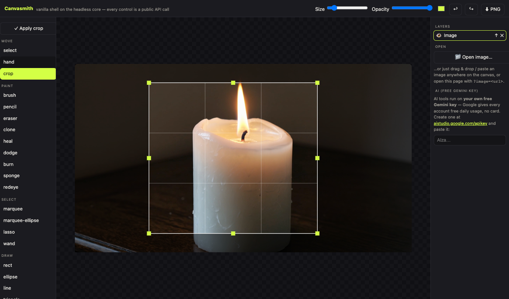
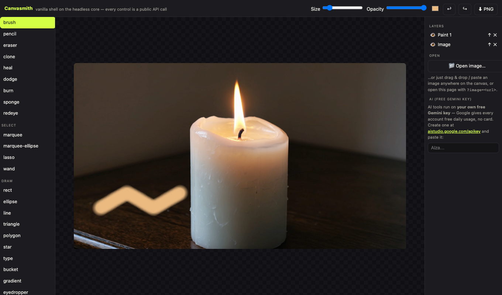

# Canvasmith

**A Photoshop-grade image editor for the web — headless core + optional UI, built on [Fabric.js](http://fabricjs.com/) (MIT).**

Use the complete tool with one `<script>`, or import the JS functions and build your own UI.


<sup>↑ the idea Canvasmith is built around: everything on the board is a live, labelled, editable layer.</sup>

## The tools, shown working

| | |
|---|---|
| **Magic wand** — one click traces the region's real silhouette  | **Fill** — the bucket pours colour only inside the live selection  |
| **Gradient** — clipped by any selection, here an ellipse marquee  | **Crop** — scrim, rule-of-thirds guides, zoom-aware handles  |
| **Colour** — eyedropper samples the flame, the brush paints with it  | |

## Quick start — complete tool (no build)

```html
<div id="editor" style="height:100vh"></div>
<script src="https://cdnjs.cloudflare.com/ajax/libs/fabric.js/5.3.0/fabric.min.js"></script>
<script src="path/to/@canvasmith/react/dist/standalone.js"></script>
<script>Canvasmith.mount('#editor', { width: 1080, height: 1080 });</script>
```

## Quick start — headless (your UI)

```js
import { Editor, GeminiProvider } from '@canvasmith/core';

const ed = new Editor({ fabric, canvasEl: myCanvas, width: 1080, height: 1080 });
ed.setTool('brush');
ed.setToolOptions({ size: 40, color: '#ff5722' });
ed.on('history', ({ past, future }) => renderUndoButtons(past, future));
ed.ai.register(new GeminiProvider());        // or your own backend provider
const png = ed.exportPNG();
```

The vanilla demo (`apps/demo/`) is exactly this — every control is one public API call.

## React

```jsx
import { CanvasmithEditor } from '@canvasmith/react';
<CanvasmithEditor width={1080} height={1080} image={someURL} onExport={saveToMyApp} />
```

## AI providers

The editor never talks to a model directly. Implement any subset of
`magicEdit / generateImage / removeBackground / detectRegions / describe` and register it:

```js
ed.ai.register({ async magicEdit(dataURL, instruction) { return myBackend(dataURL, instruction); } });
```

No provider → AI buttons report themselves unavailable; nothing breaks. SaaS hosts should keep
keys server-side (see `adapters/ditto` for a real example); individuals can use the bundled
`GeminiProvider` with their free key, stored only in their own browser.

## Repository layout

| Path | What |
|---|---|
| `packages/core` | headless engine — zero dependencies beyond peer `fabric` |
| `packages/react` | drop-in UI + framework-free `mount()` (standalone bundle includes React) |
| `apps/demo` | vanilla-JS shell over the core: `npm run demo` → localhost:8901/apps/demo/ |
| `plugins/bookmarklet` | "Edit in Canvasmith" from any site (works on auth-gated images) |
| `plugins/browser-extension` | MV3 right-click → edit |
| `plugins/integrations` | per-platform recipes (Midjourney, ChatGPT, SD-WebUI, ComfyUI…) |
| `adapters/ditto` | reference: plugging a SaaS backend in as the AI provider |

## Develop

```bash
npm install         # dev deps (react, for the standalone bundle)
npm test            # core unit tests (node:test, no browser needed)
npm run build       # packages/react/dist/{index.js, standalone.js}
npm run demo        # serve the repo → open /apps/demo/index.html
```

## License

MIT — see [LICENSE](LICENSE). Fabric.js is MIT, © its contributors.
